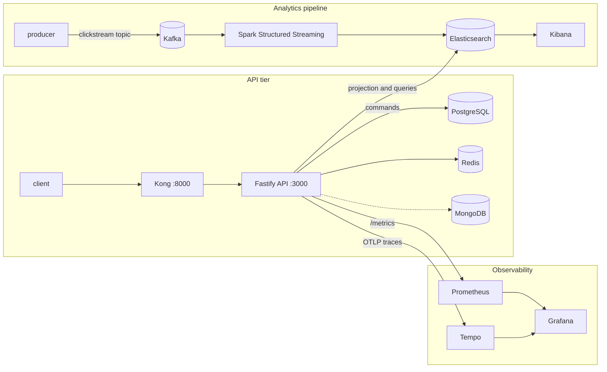

# AdLab

**Learn how cloud infrastructure actually works — locally, with no cloud provider abstractions.**

AdLab is a working, laptop-scale implementation of the classic *ad click aggregator* system design:
click events flow through **Kafka**, are aggregated by **Spark Structured Streaming**, land in
**Elasticsearch**, and are served by a **CQRS API** with GraphQL. Around it sits the operational
stack you would expect in production: an API gateway, metrics, distributed tracing, dashboards,
Kubernetes manifests and GitOps. Everything runs from one `docker compose` file.

It is a **learning environment, not a production system.** Credentials are lab defaults and every
port is bound to `127.0.0.1`.

> **Status:** the analytics pipeline, API, observability and CI-style checks are verified end to end
> (see [Verify it works](#verify-it-works)). The 0-to-Hero tutorial lives in the dashboard's
> **Tutorials** tab (`node dashboard/server.js`) — chapter 0 is up, more chapters land incrementally.
> The Kubernetes/GitOps part is [experimental](#kubernetes-and-gitops-experimental).

## Architecture



The API's `/v1/metrics/trending` and `/v1/metrics/clicks` endpoints read the aggregates that Spark
writes, so the two halves meet in Elasticsearch.

## Quick start

Requirements: Docker Desktop (macOS/Windows) or Docker Engine with **Compose v2**, plus `bash`,
`curl` and `python3` on the host. You do **not** need Node or Python installed — the API, Spark and
the producer all run in containers.

> **Fresh Linux install?** Your distro's own Docker package (e.g. Ubuntu's `docker.io`) often
> lacks the Compose v2 and `buildx` plugins that `docker.com`'s own install doesn't. `preflight.sh`
> catches both before they cause a confusing mid-build failure; fixes are in
> [CONTRIBUTING.md#troubleshooting](CONTRIBUTING.md#troubleshooting).

```bash
git clone https://github.com/brunooffs/adlab-lab.git
cd adlab-lab

./start.sh                 # core: PostgreSQL, Redis, MongoDB, Elasticsearch, API
bin/smoke.sh               # checks the API end to end

./start.sh streaming       # adds Kafka, Kafka UI, Spark
bin/e2e.sh                 # proves the whole click pipeline (about 1 minute)
```

`start.sh` runs pre-flight checks (Docker, memory, ports) and waits until the API is healthy.
On native **Linux**, Elasticsearch needs `sudo sysctl -w vm.max_map_count=262144`
(the pre-flight check tells you).

## Choose what to run: profiles

Running everything at once is heavy, so services are grouped into compose profiles:

```bash
./start.sh                                  # core only
./start.sh streaming analytics              # core + Kafka/Spark + Kibana
./start.sh all                              # everything except 'extras'
```

| Profile | Services | Idle memory\* |
|---|---|---|
| *(core)* | PostgreSQL, Redis, MongoDB, Elasticsearch, API | ~2.0 GiB |
| `streaming` | Kafka, Kafka UI, Spark master + worker | ~1.5 GiB |
| `analytics` | Kibana | ~0.8 GiB |
| `observability` | Prometheus, Grafana, Tempo | ~0.3 GiB |
| `gateway` | Kong | ~0.2 GiB |
| `extras` | Cassandra, Keycloak (not wired into the pipeline) | ~1.6 GiB |
| **All profiles** | | **~6.4 GiB** (4.8 GiB without `extras`) |

\*Measured with `docker stats` on an Apple Silicon M1 with Docker Desktop set to 15 GiB, right after
start-up. Expect roughly 1.5 GiB more while Spark is actively processing. 8 GiB is a comfortable
minimum for core + streaming; give Docker 12 GiB or more to run every profile.

## Try it

```bash
./produce.sh 500 5         # send 500 click events at 5/second (runs in a container)
./spark.sh                 # aggregate them into Elasticsearch (Ctrl+C to stop)
curl -s 'localhost:3000/v1/metrics/trending?limit=5'
```

| What | URL |
|---|---|
| API docs (Swagger) / GraphQL IDE | http://localhost:3000/docs · http://localhost:3000/graphiql |
| Through the gateway | http://localhost:8000 |
| Kafka UI | http://localhost:8080 |
| Spark UI | http://localhost:8081 |
| Kibana | http://localhost:5601 (`bin/setup-kibana.sh` imports the dashboard) |
| Grafana (`admin` / `admin`) | http://localhost:3001 |
| Prometheus · Tempo | http://localhost:9090 · http://localhost:3200 |
| Keycloak (`admin` / `admin`) | http://localhost:8180 |

In Kibana open *AdLab — Ad Click Analytics* and set the time range to cover your events.

## Verify it works

Two scripts make the environment testable, and are meant to be run after every change or upgrade:

- **`bin/smoke.sh`** — creates records through the REST, CQRS and GraphQL APIs and checks the
  analytics endpoint.
- **`bin/e2e.sh`** — creates a throw-away Kafka topic, runs the Spark job, produces events, counts
  the clicks *in Kafka itself*, and asserts that all four Elasticsearch indices and the API report
  exactly that number. A single dropped or double-counted click fails it. On failure it keeps its
  logs in `.e2e-logs/`. It resets the aggregate indices, like `./spark.sh` does.

## Design versus implementation

The design comes from [`docs/ad-click-aggregator-schemas.docx`](docs/ad-click-aggregator-schemas.docx).
A laptop cannot run the design's scale, so this table is the honest gap — and the tutorial material:

| Design | Implemented here |
|---|---|
| Kafka: 64 partitions, replication 3, 48 h retention | 1 broker, 3 partitions, replication 1, 24 h |
| Spark: update mode, 10 s trigger, 10 s watermark | complete mode, 30 s trigger, no watermark |
| Deduplicate on `event_id` | not implemented (the producer never repeats an id) |
| Elasticsearch: 12 shards, `dynamic: false` | single node, default shard settings |
| `user-profiles` index (stateful streaming) | not implemented |
| Cassandra raw event store | container runs; nothing writes to it yet |
| Redis: dedup, URL and query caches, rate limiter | the API reads a `clicks:*` speed layer that nothing writes yet |
| Click Tracker, Redirect and Query services | `producer` and the API stand in |

## Versions

Every image is pinned. Newer majors exist for several; they are held back on purpose.

| Component | Version | Held back |
|---|---|---|
| Kafka | 4.3.1 | |
| Spark (+ Kafka and Elasticsearch connectors) | 3.5.9 | Spark 4 needs Scala 2.13 and new connectors |
| Elasticsearch / Kibana | 8.19.22 | 9.x |
| Prometheus / Grafana / Tempo | 3.13.3 / 12.4.11 / 2.10.8 | Grafana 13, Tempo 3 |
| Kong | 3.9.3 | no newer open-source image exists |
| Kafka UI | kafbat v1.5.0 | the Provectus project is unmaintained |
| PostgreSQL / Redis / MongoDB | 16.15 / 8.10.2 / 8.0.32 | Postgres 18 |
| Cassandra / Keycloak | 5.0.9 / 26.7.4 | |
| Node.js (API) | 22 | Node 24 needs Prisma 7 |

Spark's connector versions live in [`spark/Dockerfile`](spark/Dockerfile) with the rules for keeping
them consistent.

## Scripts

| Script | Purpose |
|---|---|
| `./start.sh [profile ...]` | start services (health-gated); `all` = every profile except `extras` |
| `./stop.sh` | stop everything, keep data |
| `./reset.sh [--yes]` | remove this project's containers **and volumes** (touches nothing else) |
| `./status.sh` | health, memory, indices, topics, table counts |
| `./produce.sh [events] [rate] [flags]` | send click events, e.g. `--hot-ad ad_x --buckets 4` |
| `./spark.sh` | run the streaming job (`SPARK_APP`, `RUN_SECONDS`, `STOP_FILE` are supported) |
| `./clean-es.sh` | delete the aggregate indices |
| `bin/preflight.sh` · `bin/smoke.sh` · `bin/e2e.sh` · `bin/setup-kibana.sh` | checks and setup |

## Repository layout

```
api/                 Fastify 5 + TypeScript API: REST, GraphQL, CQRS, Prisma, OpenTelemetry
producer/            click-event generator (runs in a container)
spark/               Spark image with pinned connectors
spark-jobs/          the PySpark streaming job and a stoppable runner
kong/ prometheus/ grafana/ tempo/   gateway, metrics, dashboards, tracing configuration
kibana-backup.ndjson   Kibana data views and dashboard
k8s/                 Kustomize manifests and the ArgoCD application (experimental)
bin/  docker/        helper scripts; Postgres init scripts
docs/                design reference
docker-compose.yml   the whole stack, split into profiles
```

## Kubernetes and GitOps

`k8s/` holds manifests for the **API tier only** (PostgreSQL, Redis, Elasticsearch, API) and an
ArgoCD application that syncs them from this repository. It's a separate path from the Quick Start
above — needs its own tools installed first (minikube, kubectl), and everything from there is run
by hand rather than through a single script, deliberately — see [`k8s/README.md`](k8s/README.md)
for the full setup and why. It is not covered by `bin/e2e.sh` and has no Kafka or Spark.

## Known limitations

- Cassandra and Keycloak run under `extras` but nothing uses them yet.
- No event deduplication, and the Redis speed layer is read but never written (see the table above).
- Prisma is on 5.x: its `$use` middleware, used for tracing spans, is removed in Prisma 7, so that
  upgrade is a separate piece of work.
- Verified end to end on Apple Silicon (M1) and on Intel Linux (Ubuntu/Debian-based); the images
  are multi-arch.

## Troubleshooting

- **A port is busy** — `bin/preflight.sh` lists which; stop the other process or the old stack.
- **Something is unhealthy** — `./status.sh`, then `docker compose logs <service>`.
- **A failed `bin/e2e.sh`** — read the "first errors" block it prints, then `.e2e-logs/`.
- **Start clean** — `./reset.sh --yes && ./start.sh`.

## Third-party software

Images are pulled from their upstream registries at run time and are not redistributed here. Several
(Elasticsearch, Kibana, MongoDB, Redis, Grafana, Tempo) are not Apache-2.0 — they use licenses such as
Elastic License 2.0, SSPL or AGPL. Check each project's license before using it commercially.

## License

[MIT](LICENSE)
