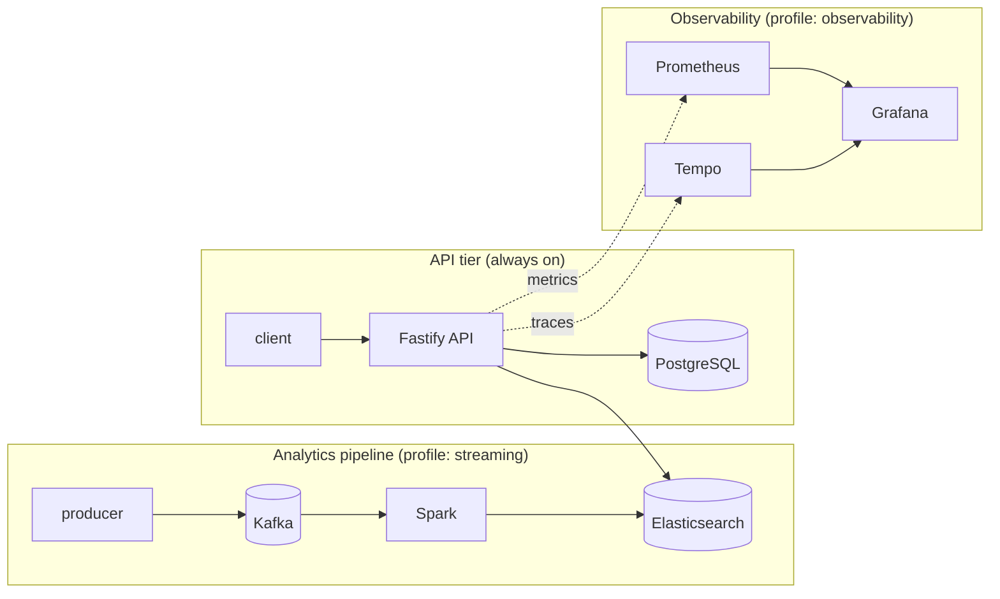

# Chapter 0 — Setup and mental model

## What this is

AdLab is a working implementation of a classic system-design interview question: **build an ad
click aggregator**. Click events flow through Kafka, get aggregated by Spark, land in
Elasticsearch, and are served by an API. Around that core sits everything you'd find in a real
production stack: a gateway, metrics, tracing, dashboards, Kubernetes manifests.

The point isn't the ad-tech domain. It's that every piece here is *real* — the same Kafka, the same
Spark, the same failure modes you'd hit running this in production — just small enough to fit on a
laptop and cheap enough to break on purpose.

## The three things happening at once

It helps to separate this into three independent systems that happen to share one Elasticsearch
cluster. Confusing them is the single most common source of "why is this empty?" questions later in
this tutorial.

**1. The API tier.** A Fastify service backed by PostgreSQL (the write model) and Elasticsearch (a
read model, kept in sync via a CQRS projection). This works on its own — `./start.sh` with no
profile gives you this and nothing else.

**2. The analytics pipeline.** A one-way flow: the producer generates click events into Kafka,
Spark aggregates them into four Elasticsearch indices, and the API's `/v1/metrics/*` endpoints read
those indices. This is the `streaming` profile. It does not exist until you start it — the API runs
fine without it, just with empty analytics.

**3. Observability.** Prometheus scrapes metrics, Tempo collects traces, Grafana shows both. This
watches the other two systems; it doesn't feed into them.



If you remember one thing from this chapter, make it this: **Elasticsearch is the only thing all
three systems share.** Everything else is independent, and you can start, stop, and break each one
without touching the others.

## Why profiles exist

Running everything at once on a laptop is genuinely heavy — around 6.4 GiB idle, more while Spark
is processing. Rather than making you choose between "one giant stack" and "nothing," the compose
file is split into profiles: `streaming`, `analytics`, `observability`, `gateway`, `extras`. Core
(the API tier) has no profile flag — it's always part of `./start.sh`, whatever else you add.

This matters for how you'll work through the rest of this tutorial: each chapter tells you which
profile to start. You don't need everything running for every chapter.

## Try it

```bash
git clone https://github.com/brunooffs/adlab-lab.git
cd adlab-lab
./start.sh
```

Watch what happens. `start.sh` runs pre-flight checks first — Docker reachable, Compose v2 present,
enough memory, `vm.max_map_count` high enough for Elasticsearch, no port conflicts — *before*
touching Docker at all. This exists because every one of those checks corresponds to a real failure
this project hit during development: a missing Compose plugin, a kernel setting too low for
Elasticsearch to start, a `buildx` plugin needed for one Dockerfile's `--chmod` flag. Catching them
in three seconds beats discovering them fifty seconds into a build.

Once it's up:

```bash
bin/smoke.sh
```

This creates a few records through the REST, CQRS, and GraphQL APIs and checks they come back out
correctly. It's the fastest way to know "is the API tier actually working," and you'll use it again
in later chapters after making changes.

## What you should see

- `docker ps` shows five containers: `postgres`, `redis`, `mongodb`, `elasticsearch`, `api`, plus a
  `migrate` container that already exited (that's correct — it's a one-shot job that runs
  `prisma migrate deploy` and then stops; `api` waits for it to succeed before starting).
- `curl localhost:3000/health` returns `{"status":"ok",...}`.
- `curl 'localhost:3000/v1/metrics/trending'` returns `{"ads":[]}` — empty, because the analytics
  pipeline (`streaming` profile) isn't running yet. That's expected, not broken.

## What's next

Chapter 1 starts with the `streaming` profile and traces one click event all the way from the
producer to a number in Elasticsearch — the thing that was empty a moment ago.

If something in this chapter didn't work as described, `./status.sh` shows health for everything,
and `bin/e2e.sh` is a stronger end-to-end check you'll meet properly in Chapter 4.
