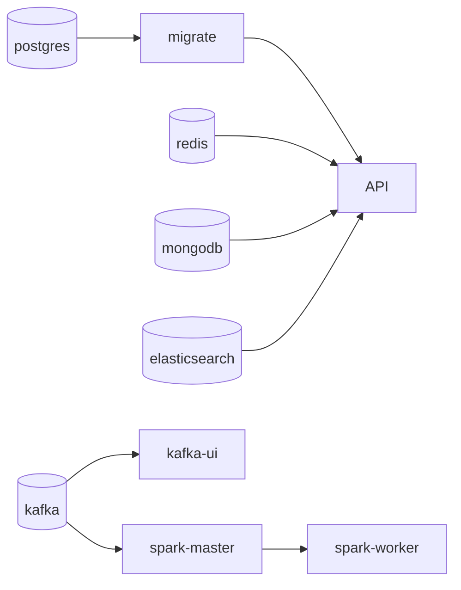

# Chapter 1 — Containers and Compose as a mini-datacenter

## What you'll do

Start the `streaming` profile, watch Compose bring services up in the right order without being
told to, and see exactly what a profile buys you.

```bash
./start.sh streaming
```

## Dependency graphs, not scripts

Nothing in this repo has a step-by-step "start Postgres, wait, then start the API" script anymore.
Instead, `docker-compose.yml` declares *what depends on what*, and Compose works out the order:



`migrate` is worth looking at closely — it's a one-shot container that runs `prisma migrate
deploy` and then exits. `api` doesn't just depend on Postgres being *up*; it depends on `migrate`
*exiting successfully* (`condition: service_completed_successfully`). If a migration fails, the API
container never starts, instead of starting against a database schema it doesn't understand. Check
it yourself:

```bash
docker ps -a --filter name=migrate --format '{{.Names}}: {{.Status}}'
```

## Profiles are just filters

A profile is not a different compose file, a different network, or a different anything — it's a
label on a service that says "only start me if this label is requested." Services with no profile
(Postgres, Redis, MongoDB, Elasticsearch, `migrate`, the API) are the ones you'd call "core," and
they start on every `./start.sh` call regardless of what else you ask for.

```bash
docker compose config --services   # every service Compose knows about
```

Try `./start.sh` with no arguments, then `docker ps` — five containers. Then `./start.sh streaming`
— four more appear (`kafka`, `kafka-ui`, `spark-master`, `spark-worker`), and the five core ones
don't restart or rebuild, because they're already running and Compose recognizes that.

## Why the images build the way they do

Two Dockerfiles in this repo are worth understanding, not just running:

**`api/Dockerfile`** is a two-stage build: a `builder` stage with dev dependencies (needed to
compile TypeScript and generate the Prisma client), and a slim `runtime` stage with only production
dependencies. `docker-compose.yml` builds `api` and `migrate` from the *same* Dockerfile with
different `image:` tags — they need separate tags because two services building to the same image
name race each other (this project hit that exact bug once; the fix was one line).

**`spark/Dockerfile`** downloads five pinned JAR files — Kafka connector, Elasticsearch connector,
and their transitive dependencies — instead of shipping them as binary files in git. It uses `ADD
--chmod=644`, which is BuildKit-only. If `docker compose build` falls back to the legacy builder
(no `buildx` plugin installed), this Dockerfile is the one that fails, about 50 seconds in, with an
error that doesn't obviously point at "install buildx." `bin/preflight.sh` checks for this before
you hit it.

## Try breaking it, safely

```bash
./stop.sh                 # containers stop; volumes (your data) are untouched
docker ps                 # empty
./start.sh streaming      # everything comes back, same data, no rebuild needed
```

Compare that with:

```bash
./reset.sh                # asks for confirmation, then WIPES volumes too
```

`reset.sh` used to call `docker system prune --volumes` — a command that deletes volumes belonging
to *every* project on your machine, not just this one. That's gone now; `reset.sh` only ever
touches containers and volumes whose names start with `adlab_`, because the compose file declares
`name: adlab` up top. Worth knowing if you ever wonder why deleting one lab's data is safe here when
it wouldn't necessarily be elsewhere.

## What's next

Chapter 2 looks at what's actually inside `postgres` once `migrate` has run against it — the schema,
and a design decision (`cuid()` IDs, no index on a foreign key) that's easy to miss until it bites.
